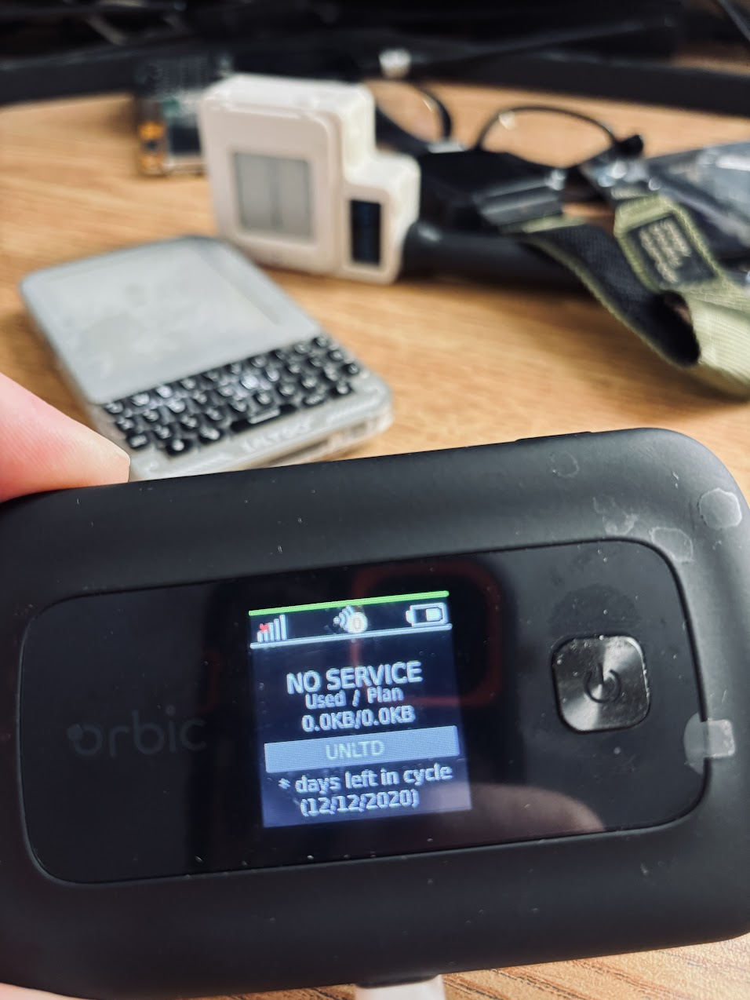
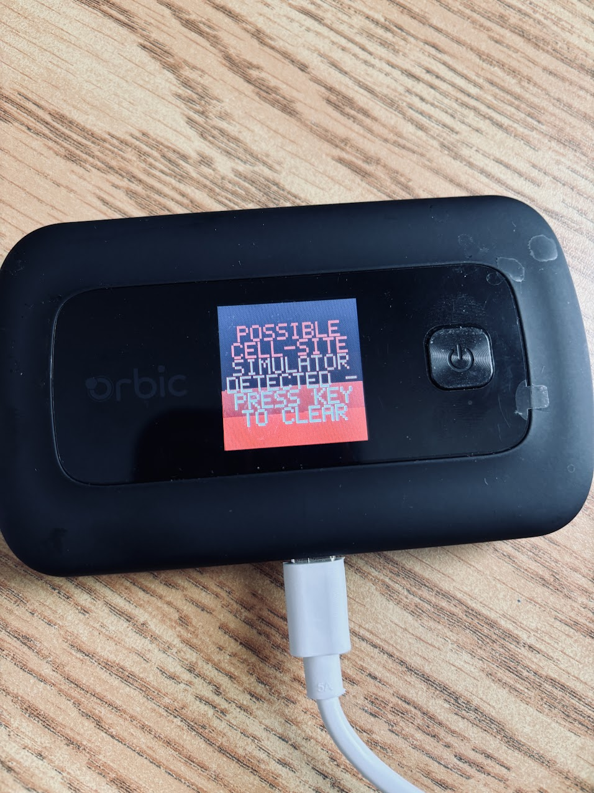
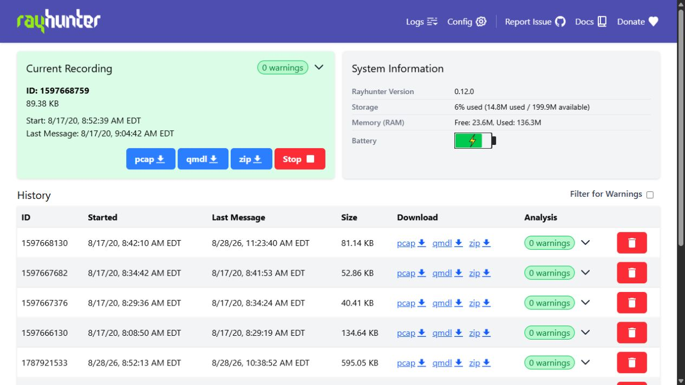
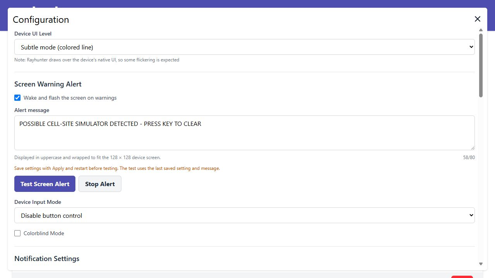

# Rayhunter


Rayhunter is a project for detecting IMSI catchers, also known as cell-site simulators or stingrays. It was first designed to run on a cheap mobile hotspot called the Orbic RC400L, but thanks to community efforts, it can [support some other devices as well](https://efforg.github.io/rayhunter/supported-devices.html). It is designed to be easy to install and use regardless of technical experience, and to minimize false positives.

This fork is based on Rayhunter 0.12.0 and adds a **latched, on-device warning screen** for Orbic RC400L and Moxee hardware. A heuristic detection can wake a sleeping display and flash a plain-English alert until someone acknowledges it on the device. The warning is completely local: a phone, web browser, Internet connection, or connection to the hotspot is not required when a detection occurs.

> [!IMPORTANT]
> Sentinel XTOC LAN alert-packet support is planned as the next phase. It is **not implemented in this revision**.

## On-device screen alert

### What this fork adds

- Wakes the built-in 128 × 128 display when Rayhunter reports a warning.
- Alternates a red/white warning frame and a dark/red frame every 500 ms.
- Keeps flashing until the alert is explicitly acknowledged; the normal display timeout does not silence it.
- Clears the overlay with the physical **Power/OK** or **Menu** button, or with **Stop Alert** in the web UI.
- Restores the framebuffer, brightness, blanking state, vendor display state, and backlight state that existed before the alert.
- Preserves recording and warning state. Acknowledging the overlay does not stop a recording, erase a capture, or remove its warning.
- Alerts on the first non-informational warning in a recording. After acknowledgement, the same or a lower severity does not repeatedly wake the screen; a higher severity or the first warning in a new recording alerts again.
- Includes an enable/disable setting, configurable English message, character counter, validation, **Test Screen Alert**, and **Stop Alert** controls.
- Includes `POST /api/test-screen-alert` and `POST /api/acknowledge-screen-alert` endpoints with bounded response timeouts and explicit error responses.
- Uses the Orbic vendor LCD initialization and backlight controls when waking a fully sleeping panel. This prevents the solid-white, full-backlight failure caused by turning on only the backlight.
- Keeps the alert command path separate from recording/display status so a test or acknowledgement cannot manufacture or erase a detection.
- Exposes the controls only on the currently supported Orbic/Moxee framebuffer path; other device implementations continue using their existing display behavior.

### Hardware result

The left image is the normal Orbic interface after the overlay has been cleared. The right image is the same physical device displaying the latched test alert.

| Normal/idle device screen                                                                        | Active warning overlay                                                                                                        |
| ------------------------------------------------------------------------------------------------ | ----------------------------------------------------------------------------------------------------------------------------- |
|  |  |

### Web interface

The normal dashboard continues to provide recording, capture-download, analysis, storage, memory, and battery status.



Open **Config** to enable the local alert, edit its message, start a hardware test, or stop an active alert.



## Configure and test the alert

1. Connect a phone or computer to the Rayhunter hotspot, or use a device on the same LAN when Wi-Fi client mode is enabled.
2. Open <http://192.168.1.1:8080> for the default Orbic/Moxee address.
3. Select **Config**.
4. Under **Screen Warning Alert**, check **Wake and flash the screen on warnings**.
5. Enter the message to show on the device.
6. Select **Apply and restart**. Wait for the daemon and web UI to return.
7. Reopen **Config** and select **Test Screen Alert**.
8. Confirm that the display wakes and continuously flashes the configured text.
9. Press **Power/OK** or **Menu** on the device. The prior display and backlight state should return. **Stop Alert** performs the same acknowledgement from the web UI.

The test exercises the real wake, LCD initialization, rendering, flash, acknowledgement, and restore path, but it does **not** create a heuristic warning or modify a recording.

Once configured, the phone or browser can be disconnected. Detection, display wake, flashing, and physical-button acknowledgement all run locally on the Rayhunter device, including while it is being carried in a vehicle.

### Message rules

The message is normalized to uppercase and repeated whitespace is collapsed. It must:

- contain 1–80 characters;
- wrap to no more than eight lines;
- fit no more than ten characters per rendered line; and
- use spaces, uppercase letters (`A-Z`), digits (`0-9`), and these punctuation marks: `- . , ! ? : / '`.

The renderer uses a scaled 5 × 7 bitmap font. Words longer than ten characters are split across lines. The supplied default is:

```text
POSSIBLE CELL-SITE SIMULATOR DETECTED - PRESS KEY TO CLEAR
```

## Configuration file

The same settings can be edited in `/data/rayhunter/config.toml`:

```toml
[screen_alert]
enabled = true
message = "POSSIBLE CELL-SITE SIMULATOR DETECTED - PRESS KEY TO CLEAR"
```

Restart Rayhunter after editing the file. Existing configurations that do not contain this section receive the default values through Serde defaults. The distribution template enables the alert by default.

See [Configuration](doc/configuration.md) for the rest of Rayhunter's settings and [Using Rayhunter](doc/using-rayhunter.md) for normal recording and web-interface operation.

## HTTP controls

Both alert actions use `POST` and require no request body.

| Endpoint                        | Successful result                             | Important errors                                                                            |
| ------------------------------- | --------------------------------------------- | ------------------------------------------------------------------------------------------- |
| `/api/test-screen-alert`        | `200 OK` after the first alert frame is drawn | `409` when disabled; `503` when unsupported/unavailable; `504` on display timeout           |
| `/api/acknowledge-screen-alert` | `200 OK` when an active alert is cleared      | `409` when no alert is active; `503` when unsupported/unavailable; `504` on display timeout |

Examples:

```sh
curl -X POST http://192.168.1.1:8080/api/test-screen-alert
curl -X POST http://192.168.1.1:8080/api/acknowledge-screen-alert
```

Rayhunter's port 8080 web interface is plain HTTP. Treat the hotspot/LAN as a trusted local network and do not expose it directly to the public Internet.

## Install this fork on an Orbic RC400L

The standard EFF 0.12.0 installer does not contain this fork's screen-alert code. Until this fork publishes a packaged release, build and install it from source.

### Before installing

- Charge the Orbic and keep it connected to power during installation.
- Connect the computer to the Orbic hotspot and confirm that <http://192.168.1.1> opens.
- The installer login is the device's OEM admin portal account, not a new Rayhunter account. The default username is `admin`. On a Verizon Orbic, the default admin password is normally the device's Wi-Fi password. See the [Orbic device instructions](doc/orbic.md#installing) for other models and reset details.
- Back up any captures you care about. Reinstalling normally preserves `config.toml`; do not pass `--reset-config` unless you intentionally want to replace it.

Never commit a real device password to this repository. Substitute it only at the command line where `<device-admin-password>` appears below.

### Windows PowerShell

Install Git, Node.js/npm, Rust through `rustup`, and native compiler tools. The tested native Windows build used the GNU Rust host toolchain plus LLVM/Clang. Then run:

```powershell
git clone https://github.com/MKme/rayhunter.git
Set-Location rayhunter

Push-Location daemon/web
npm ci
npm run build
Pop-Location

rustup target add armv7-unknown-linux-musleabihf
cargo build-daemon-firmware-devel
cargo run -p installer --bin installer -- orbic `
  --admin-ip 192.168.1.1 `
  --admin-username admin `
  --admin-password '<device-admin-password>'
```

PowerShell single quotes are important when a password contains `$` or other shell metacharacters. The network installer uploads the custom daemon, leaves the existing config in place unless `--reset-config` is supplied, and reboots the device. When the device returns, open <http://192.168.1.1:8080>.

### Linux, macOS, or WSL

With Rust, Node.js/npm, and the documented compiler dependencies installed:

```sh
git clone https://github.com/MKme/rayhunter.git
cd rayhunter
./scripts/build-dev.sh
./scripts/install-dev.sh orbic --admin-password '<device-admin-password>'
```

For complete source-build prerequisites and other devices, see [Installing from source](doc/installing-from-source.md). For general device support, see [Supported devices](doc/supported-devices.md).

## Update an existing installation

Pull the newest `main`, rebuild the web frontend and ARM daemon, and rerun the same `orbic` installer command. Omit `--reset-config` to keep the current message and enabled/disabled state.

```powershell
git pull --ff-only origin main
Push-Location daemon/web
npm ci
npm run build
Pop-Location
rustup target add armv7-unknown-linux-musleabihf
cargo build-daemon-firmware-devel
cargo run -p installer --bin installer -- orbic --admin-password '<device-admin-password>'
```

## Troubleshooting

### The screen wakes solid white

That symptom means the panel backlight came on without the LCD controller being reinitialized after sleep. It was reproduced on the Orbic RC400L and is addressed in this fork by using the vendor `init`, `display_on`, and `bl_gpio` controls before rendering the first alert frame. Rebuild and reinstall the current fork; an older custom daemon may still have the white-screen behavior.

### Test Screen Alert reports that the feature is disabled

Check the enable box, select **Apply and restart**, wait for the service to return, and then test again. The test endpoint deliberately uses the last saved configuration rather than unsaved form contents.

### Test Screen Alert is unavailable

The full-screen alert is currently wired only for the Orbic/Moxee framebuffer implementation. Confirm that the configuration's `device` value is correct and that the custom daemon—not the stock 0.12.0 daemon—is running.

### Stop Alert reports that no alert is active

The overlay was already cleared, often by a physical button press. This does not indicate lost capture data.

### A warning did not alert a second time

Within one recording, Rayhunter sends a new display warning only when the maximum observed severity increases. After acknowledgement, start a new recording to re-arm all warning severities, or wait for a higher-severity event. Use **Test Screen Alert** when validating hardware behavior.

### There is no phone or LAN connection in the vehicle

No connection is required for the local screen alert. The web UI is needed only for configuration, testing, downloads, and remote acknowledgement. Planned Sentinel XTOC support will add optional same-LAN delivery later.

### The device clock is wrong

The web UI may offer to copy the browser clock to Rayhunter. Clock accuracy helps correlate recordings, but it is independent of the screen-alert wake and acknowledgement path.

## Implementation map

| Area                              | Files                                                                                   | Modification                                                                                                                               |
| --------------------------------- | --------------------------------------------------------------------------------------- | ------------------------------------------------------------------------------------------------------------------------------------------ |
| Configuration                     | `daemon/src/config.rs`, `dist/config.toml.in`                                           | Adds the default-enabled `[screen_alert]` section and message defaults.                                                                    |
| Alert state and renderer          | `daemon/src/display/screen_alert.rs`                                                    | Adds validation, word wrapping, the 5 × 7 font, RGB alert phases, latching, and unit tests.                                                |
| Framebuffer loop                  | `daemon/src/display/generic_framebuffer.rs`                                             | Adds the 500 ms alert ticker, alert command handling, first-frame response, restore behavior, and async display tests.                     |
| Orbic hardware wake               | `daemon/src/display/orbic.rs`                                                           | Saves/restores display state and drives the vendor LCD init, display-on, backlight GPIO, sysfs blanking, and framebuffer unblank paths.    |
| Physical acknowledgement          | `daemon/src/key_input.rs`                                                               | Watches the normal key stream plus Orbic front-panel event devices and ensures an acknowledgement press cannot trigger recording controls. |
| Daemon wiring                     | `daemon/src/display/mod.rs`, `daemon/src/main.rs`                                       | Separates alert commands from display/recording state and enables the channel for Orbic/Moxee only.                                        |
| HTTP API and API docs             | `daemon/src/server.rs`, `daemon/src/lib.rs`                                             | Adds test/acknowledge endpoints, response confirmation, timeouts, status codes, and endpoint tests.                                        |
| Web UI                            | `daemon/web/src/lib/components/ConfigForm.svelte`, `daemon/web/src/lib/utils.svelte.ts` | Adds supported-device gating, enable/message controls, validation feedback, test/stop actions, and client API types/helpers.               |
| Other framebuffer implementations | `daemon/src/display/tplink_framebuffer.rs`, `daemon/src/display/wingtech.rs`            | Explicitly pass no alert command channel, preserving existing behavior.                                                                    |
| User documentation                | `doc/configuration.md`, `doc/using-rayhunter.md`, `README.md`                           | Documents setup, acknowledgement, re-arm behavior, installation, testing, API use, and troubleshooting.                                    |

## Validation completed for this fork

- ARMv7 firmware daemon build.
- ARMv7 daemon test-harness compilation.
- Rust formatting and Clippy with warnings denied except the repository's existing `uninlined_format_args` baseline.
- Svelte type/component check with zero errors and zero warnings.
- Web unit tests: 2 files, 5 tests passed.
- Physical Orbic RC400L validation from a sleeping display: wake, English message rendering, continuous flash, physical-button acknowledgement, web acknowledgement, state restoration, and no solid-white panel.

The Windows-native daemon test command is not a valid substitute for the ARM target because the existing Wi-Fi station module is Unix-specific. Full-project npm formatting also reports pre-existing formatting issues outside this change; the modified web files were checked directly.

## Detection limitations

Rayhunter reports heuristic indicators, not proof that a particular device or organization is operating a cell-site simulator. Review the warning details and capture data before drawing conclusions. Keep Rayhunter updated as heuristics and false-positive handling improve.

## Upstream documentation and community

→ Read the [installation guide](https://efforg.github.io/rayhunter/installation.html).

→ Learn about the project and IMSI catchers in the [introductory EFF blog post](https://www.eff.org/deeplinks/2025/03/meet-rayhunter-new-open-source-tool-eff-detect-cellular-spying).

→ Find discussion, support, Mattermost, and community links in [Support, Feedback & Community](https://efforg.github.io/rayhunter/support-feedback-community.html).

→ Browse the complete [Rayhunter Book](https://efforg.github.io/rayhunter/).

**LEGAL DISCLAIMER:** Use this program at your own risk. We believe running this program does not currently violate any laws or regulations in the United States. However, we are not responsible for civil or criminal liability resulting from the use of this software. If you are located outside of the US, consult with an attorney in your country to help assess the legal risks of running this program.

_Good Hunting!_
